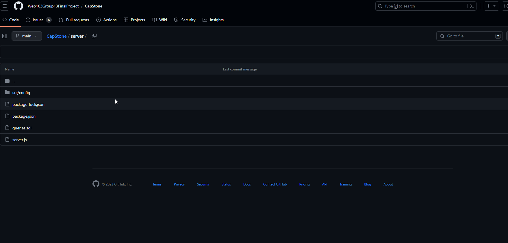

# MealMaster

CodePath WEB103 Final Project

Designed and developed by: Michael, Sushant

🔗 Link to deployed app:

## About

### Description and Purpose

MealMaster is a culinary companion platform designed to help users explore, organize, and master their cooking journey. Users can create an account, log in, and utilize various features related to meal planning and recipe sharing. With MealMaster, users can:

Discover and Share Recipes: Users can explore a diverse collection of recipes from various cuisines and share their own culinary creations.
Plan Meals: Create personalized meal plans for the week, making it easy to organize and prepare delicious dishes.
Collaborate with Friends and Family: Share meal plans and recipes with friends and family, making cooking a collaborative and enjoyable experience.
Rate and Review Recipes: Users can provide ratings and reviews for recipes they've tried, helping others make informed choices.
Find Culinary Inspiration: Whether you're a seasoned chef or a novice in the kitchen, MealMaster provides a space to find inspiration and enhance your cooking skills.

### Inspiration

The inspiration for MealMaster stems from the desire to create a user-friendly platform that combines the best aspects of culinary social media, meal planning, and recipe sharing.

## Tech Stack

Frontend:

Backend:

## Features

### Get started on backend ✅

Should start on backend first to setup database.

### User Authentication

The app should allow people to login/sign up so their personal information is connected to their account.

[gif goes here]

### Add recipes

The app should allow users to add their own recipes, so they can refer back to them and share with others.

[gif goes here]

### View recipes

The app should allow users to view recipes, so they can cook using the recipes.

[gif goes here]

### Edit recipes

The app should allow users to edit recipes, so they can make corrections or improvements.

[gif goes here]

### Delete recipes

The app should allow users to delete recipes, so they can remove recipes they no longer want.

[gif goes here]

### Create meal plan

The app should allow users to create a meal plan by selecting recipes from their saved recipes and organize them for the week.

[gif goes here]

### Filter recipes

The app should allow users to filter for recipes by category so that they can easily find what they're looking for.

[gif goes here]

### Rate and review recipes

The app should allow users to rate and review recipes, so that other users can see their feedback and make informed decisions.

[gif goes here]

## Installation Instructions

[instructions go here]